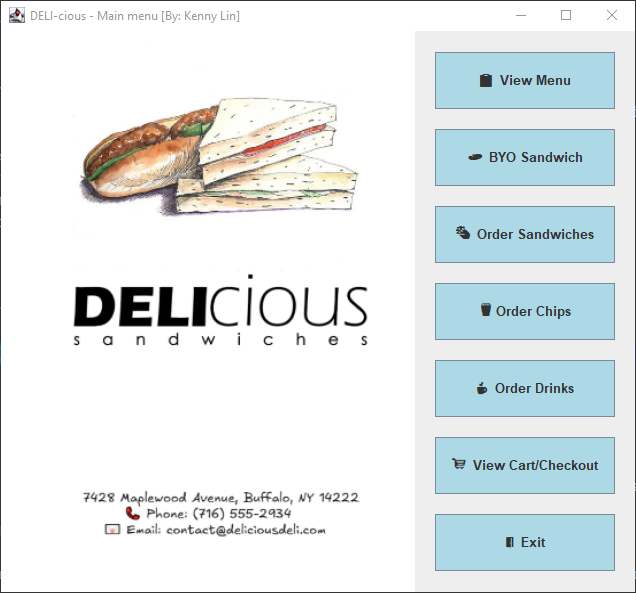
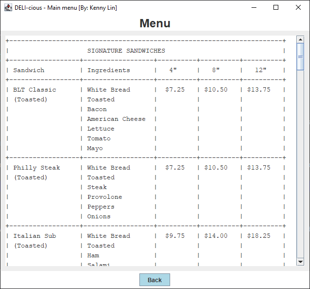
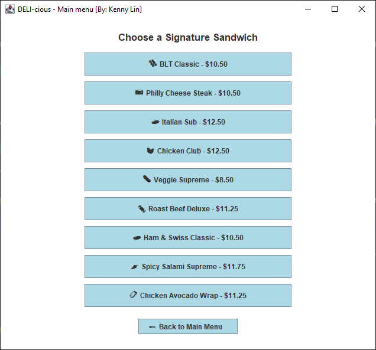
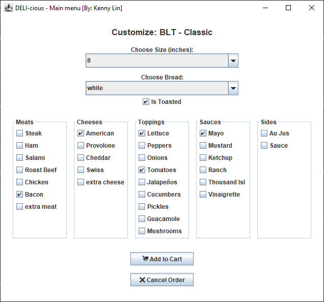
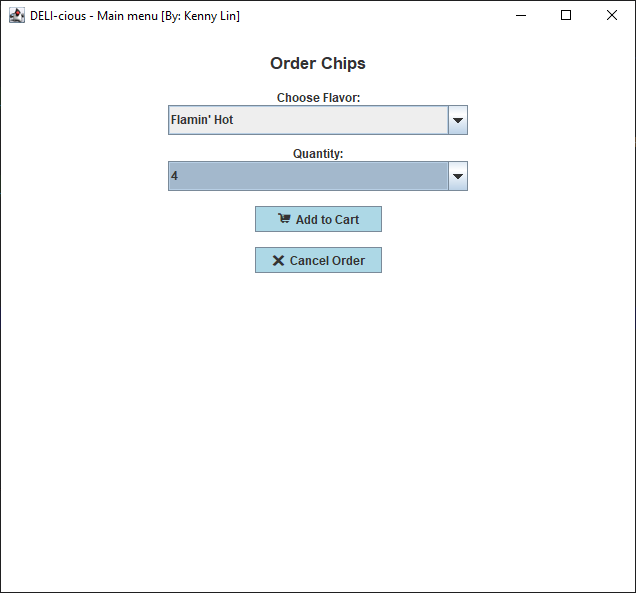
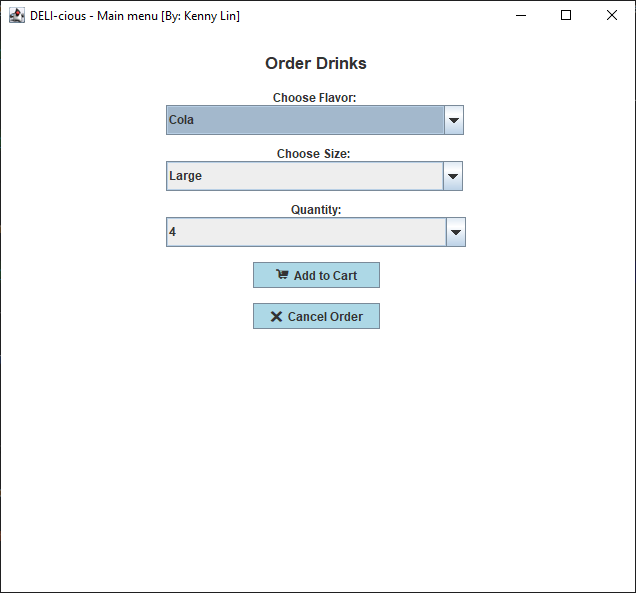
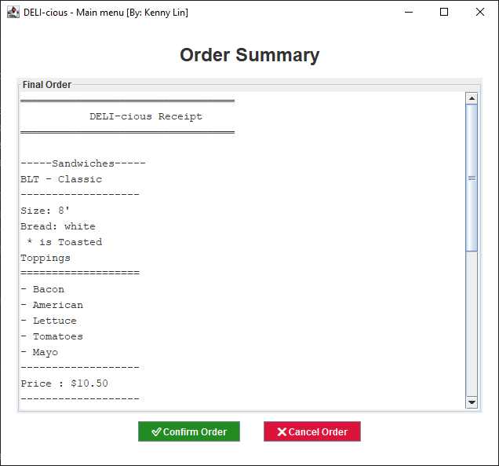
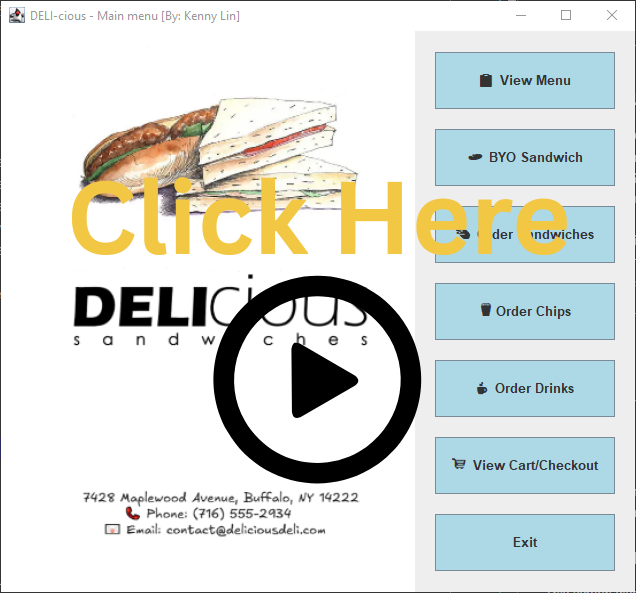

<h1 align="center">🥪 DELI-cious</h1>
<h5 align="center">By: Kenny Lin</h5>

<p align="center">
  A Java GUI application for managing custom sandwich orders with elegance and ease. ✨
</p>

<p align="center">
  
  
  
</p>

---

## 🌟 Features

✅ **Interactive GUI** - User-friendly Swing interface with modern design  
📋 **Comprehensive Menu** - View all available options with detailed pricing  
🥪 **Custom Sandwich Builder** - Create sandwiches with multiple sizes, breads, and toppings  
🍽️ **Signature Sandwiches** - Pre-made sandwiches with customization options  
🍟 **Sides & Drinks** - Add chips and beverages to complete your order  
🛒 **Smart Cart Management** - Add, remove, and modify quantities with ease  
💰 **Dynamic Pricing** - Real-time price calculations based on selections  
🧾 **Receipt Generation** - Automatic receipt creation with timestamp naming

---

## 📋 Main Menu - Display



---

## 🖼️ DELI-cious - Application Screens

Below are the main screens available in the DELI-cious application. Each section provides different functionality for creating and managing sandwich orders.

### 1. **📖 View Menu**

*This screen displays the complete menu with pricing for all sandwiches, drinks, and chips. (scrollable)*



### 2. **🥪 Build Your Own Sandwich**

*The sandwich builder allows customers to fully customize their sandwich with size, bread, and toppings.*


### 3. **🍽️ Signature Sandwiches**

*Pre-designed sandwiches that customers can order as-is and customize to their preferences.*



*ex. user chooses BLT as the sandwich they want (user can customize everything to their liking.)*



### 4. **🍟 Order Chips**

*Simple interface for selecting chip/snacks flavors and quantities.*



### 5. **🥤 Order Drinks**

*Drink selection with multiple sizes and flavors available.*



### 6. **🛒 Shopping Cart & Checkout**

*Review your order, modify quantities, and complete your purchase.*


*Confirming Purchase*



---

---

## 🎥 Video Demo

### Full Application Demo
*Click the thumbnail below to watch the complete DELI-cious application demonstration*

[](src/main/resources/demo/deli_demo.mp4)

**What you'll see in the demo:**
- 🏠 Main menu navigation
- 🥪 Custom sandwich building process
- 🍽️ Signature sandwich selection and customization
- 🍟 Adding chips and drinks to orders
- 🛒 Cart management and item removal
- 💳 Complete checkout process
- 🧾 Receipt generation

---

## 🏗️ Architecture & Design

This application demonstrates advanced **Object-Oriented Programming** principles:

- **Inheritance**: Signature sandwiches extend base sandwich functionality
- **Polymorphism**: Different product types (sandwiches, drinks, chips) implement common interfaces
- **Encapsulation**: Each class manages its own data and behavior
- **Abstraction**: Clear separation between UI and business logic

### Key Classes:
- `Sandwich` - Core sandwich with size, bread, and toppings
- `PremiumToppings` - Meats and cheeses with pricing logic
- `FreeToppings` - Vegetables, sauces, and sides at no extra cost
- `Drinks` - Beverages with size-based pricing
- `Chips` - Simple chip products with flavor options
- `FileManager` - Handles receipt generation and file I/O

---

## 🚀 How to Run

> ✅ Make sure you're using **Java 17 or higher** with Swing support.  
> 📂 The program will create a `receipts` folder for storing order receipts.

1. **Clone the repository**

   ```bash
   git clone https://github.com/kennylin894/capstoneTwo_deli.git
   ```

2. **Navigate to the project directory**
   ```bash
   cd DELI-cious
   ```

3. **Compile and run the application**
   ```bash
   javac -cp src src/com/ps/Main.java
   java -cp src com.ps.Main
   ```

   *Or run directly from your IDE (IntelliJ IDEA, Eclipse, etc.)*

4. **Required Resources**
    - Ensure the logo image is placed in `src/main/resources/images/logo.png`
    - The application will automatically create the receipts directory

---

## 💡 Interesting Code Feature

One particularly interesting aspect of this application is the **signature sandwich pre-selection system**. When customers choose a signature sandwich, the code intelligently pre-selects all the appropriate toppings in the customization interface:

```java
// Pre-select toppings for signature sandwiches
ArrayList<String> signatureSandwichToppings = new ArrayList<>();
for(Toppings toppings : signatureSandwich.getToppings()) {
        signatureSandwichToppings.add(toppings.getName());
        }

// Auto-check the appropriate checkboxes based on signature sandwich recipe
        for (String meat : PremiumToppings.getMeatToppings()) {
JCheckBox cb = new JCheckBox(meat);
   cb.setOpaque(false);
   if (signatureSandwichToppings.contains(meat)) {
        cb.setSelected(true);
   }
           meatsPanel.add(cb);
   meatCheckBoxes.add(cb);
}
        for (String cheese : PremiumToppings.getCheeseToppings()) {
JCheckBox cb = new JCheckBox(cheese);
   cb.setOpaque(false);
   if (signatureSandwichToppings.contains(cheese)) {
        cb.setSelected(true);
   }
           cheesesPanel.add(cb);
   cheeseCheckBoxes.add(cb);
}
        for (String topping : Freetoppings.getToppings()) {
JCheckBox cb = new JCheckBox(topping);
   cb.setOpaque(false);
   if (signatureSandwichToppings.contains(topping)) {
        cb.setSelected(true);
   }
           normalToppingsPanel.add(cb);
   toppingCheckBoxes.add(cb);
}
```

---

## 📁 Project Structure

```
DELI-cious/
├── src/
│   └── com/ps/
│       ├── Main.java
│       ├── UserInterface.java
│       └── Core/
│           ├── Product.java
│           ├── Sandwich.java
│           ├── Toppings.java
│           ├── PremiumToppings.java
│           ├── FreeToppings.java
│           ├── Drinks.java
│           ├── Chips.java
│           └── FileManager.java
├── receipts/ (auto-generated)
└── README.md
```
---
## 🙌 Final Notes

Thank you for checking out DELI-cious! This project showcases modern Java GUI development combined with solid OOP principles. The application provides a complete point-of-sale experience for a custom sandwich shop.

Feel free to fork, clone, and expand upon it. 🛠️

---

## 📫 Contact & Socials

- **Email**: klin@appdev.yearup.org
- **GitHub**: [@Kennylin894](https://github.com/kennylin894)
- **LinkedIn**: [@kennay-lin](https://www.linkedin.com/in/kennay-lin/)